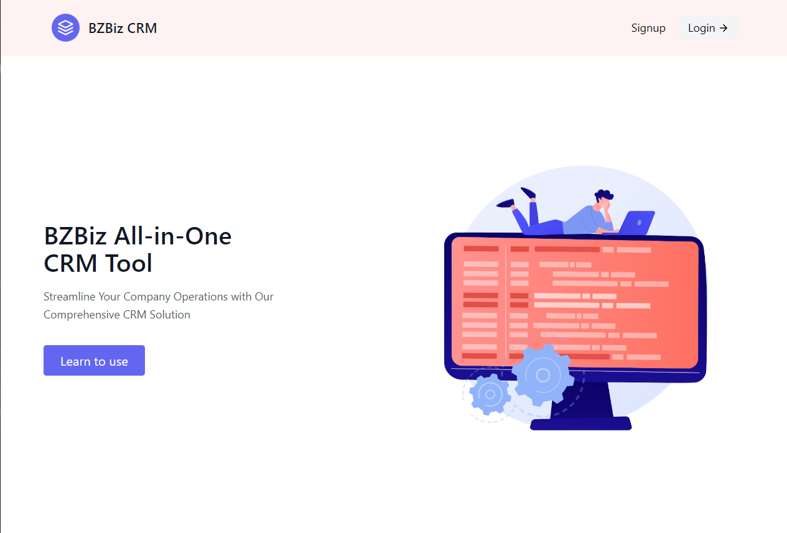

# BZBiz CRM

### About

(MVP) CRM Tool made with Django and Tailwind

### Preview

#### Live site: https://bzbiz-crm.com/

### Features

In this CRM system, aside from the built-in admin user, there are two types of Users, an organizer and an agent. Each
organizer have their own
organization/workspace. Each time an account is created, it is by default an organizer

#### Auth features:

- Login/register
- Reset password via code sent by email

#### Organizers can:

- Create/ Add Leads for their workspace
- View Leads belonging to their own workspace
- Edit Leads belonging to their own workspace
- Delete leads belonging to their own workspace
- Create Agent accounts (account explicitly marked as agent account) belonging to their own workspace, for personnel to
  sign in as an agent
- Invitation to login is sent to email of the person when agent account is created for them
- Assign an Agent to a lead

#### Agents can:

- Signin as agent
- View Leads that have been assigned to them that are of their organization
- Edit the status of leads they're handling (contacted, converted, unconverted)

